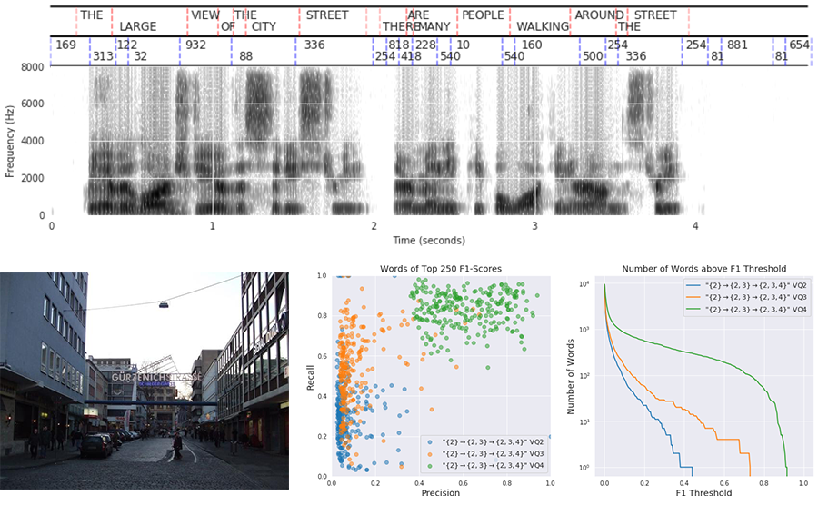

# ResDAVEnet-VQ
Official PyTorch implementation of [Learning Hierarchical Discrete Linguistic 
Units from Visually-Grounded Speech](https://openreview.net/forum?id=B1elCp4KwH)


## What is in this repo?
- Multi-GPU training of ResDAVEnet-VQ
- Quantitative evaluation
  - Image-to-speech and speech-to-image retrieval
  - ZeroSpeech 2019 ABX phone-discriminability test
  - Word detection
- Qualitative evaluation
  - Visualize time-aligned word/phone/code transcripts
  - F1/recall/precision scatter plots for model/layer comparison




If you find the code useful, please cite
```
@inproceedings{Harwath2020Learning,
  title={Learning Hierarchical Discrete Linguistic Units from Visually-Grounded Speech},
  author={David Harwath and Wei-Ning Hsu and James Glass},
  booktitle={International Conference on Learning Representations},
  year={2020},
  url={https://openreview.net/forum?id=B1elCp4KwH}
}
```

## Pre-trained models
| Model               | R@10          | Link  | MD5 sum | 
| -------------       |:-------------:| -----:| ------: |
| {}                  | 0.735         | [gDrive](https://drive.google.com/file/d/1J-tw3eg3R5e9k0vIfQaBVKiaHyOJUcIB/view?usp=sharing) | e3f94990c72ce9742c252b2e04f134e4 |
| {}->{2}             | 0.760         | [gDrive](https://drive.google.com/file/d/1MhC6PCkt7DBQvWTvf-c_ru4HSHmSb9AP/view?usp=sharing) | d8ebaabaf882632f49f6aea0a69516eb |
| {}->{3}             | 0.794         | [gDrive](https://drive.google.com/file/d/1bmFQeP_BCQ5wvq8yutqQzUmwRr5iHnCf/view?usp=sharing) | 2c3a269c70005cbbaaa15fc545da93fa |
| {}->{2,3}           | 0.787         | [gDrive](https://drive.google.com/file/d/1mQW2Sh_FCDWaHYi-02XzocQObtnAZDc7/view?usp=sharing) | d0764d8e97187c8201f205e32b5f7fee |
| {2}                 | 0.753         | [gDrive](https://drive.google.com/file/d/1vGF8DCvsT3Gy-31nn5cYmD4dqrgzmQTF/view?usp=sharing) | d68c942069fcdfc3944e556f6af79c60 |
| {2}->{2,3}          | 0.764         | [gDrive](https://drive.google.com/file/d/1pOSQ1LLmcj0DJPSyBWxsqiFAfBYZi7Vd/view?usp=sharing) | 09e704f8fcd9f85be8c4d5bdf779bd3b |
| {2}->{2,3}->{2,3,4} | 0.793         | [gDrive](https://drive.google.com/file/d/1k41E7MP_LRTzPD0XwTHNzEBbiv05Ali7/view?usp=sharing) | 6e403e7f771aad0c95f087318bf8447e |
| {3}                 | 0.734         | [gDrive](https://drive.google.com/file/d/1yCtGdYrL8K-RaRN1PMdf_MKogFSnXkue/view?usp=sharing) | a0a3d5adbbd069a2739219346c8a8f70 |
| {3}->{2,3}          | 0.760         | [gDrive](https://drive.google.com/file/d/1K23y5u4K14gMycP9XhkwTGWN-GHNCcYA/view?usp=sharing) | 6c92bcc4445895876a7840bc6e88892b |
| {2,3}               | 0.667         | [gDrive](https://drive.google.com/file/d/1JHHgJ0wDlFs9Ol1Wo4kco7HSjc4zTy_Y/view?usp=sharing) | 7a98a661302939817a1450d033bc2fcc |


## Data preparation

### Download the MIT Places Image/Audio Data
We use **MIT Places scene recognition database** (Places Image) and a paired
**MIT Places Audio Caption Corpus** (Places Audio) as visually-grounded speech, 
which contains roughly 400K image/spoken caption pairs, to train ResDAVEnet-VQ.
- Places Image can be downloaded [here](http://places.csail.mit.edu/)
- Places Audio can be downloaded [here](https://groups.csail.mit.edu/sls/downloads/placesaudio/index.cgi)

### Optional data preprocessing
Data specifcation files can be found at `metadata/{train,val}.json` inside the 
Places Audio directory; however, they do not include the time-aligned word 
transcripts for analysis. Those with alignments can be downloaded here:
- [train](https://drive.google.com/file/d/17iZpPVkgwga1Av7xZQJY7ONg9auKmPvr/view?usp=sharing)
- [valid](https://drive.google.com/file/d/1Z8-KO3b2gEk8uh3MC6w3jFVxmrz2Newe/view?usp=sharing)

Open the `*.json` files and update the values of `image_base_path` and 
`audio_base_path` to reflect the path where the image and the audio datasets 
are stored. 

To speed up data loading, we save images and audio data into the 
[HDF5](https://www.hdfgroup.org) binary files, and use the 
[h5py](https://www.h5py.org/) Python interface to access the data.
The corresponding PyTorch Dataset class is `ImageCaptionDatasetHDF5` in
`./dataloaders/image_caption_dataset_hdf5.py`. To prepare HDF5 datasets, run
```
./scripts/preprocess.sh
```
(We do support on-the-fly feature processing with the `ImageCaptionDataset` class 
in `./dataloaders/image_caption_dataset.py`, which takes a data specification 
file as input (e.g., `metadata/train.json`). However, this can be very slow)

`ImageCaptionDataset` and `ImageCaptionDatasetHDF5` are interchangeable, but 
most scripts in this repo assume the preprocessed HDF5 dataset is available.
Users would have to modify the code correspondingly to use 
`ImageCaptionDataset`.


## Interactive Qualtitative Evaluation
See `run_evaluations.ipynb`


## Quantitative Evaluation

#### ZeroSpeech 2019 ABX Phone Discriminability Test
Users need to download the dataset and the Docker image by following the 
instructions [here](https://zerospeech.com/2019/getting_started.html).

To extract ResDAVEnet-VQ features, see `./scripts/dump_zs19_abx.sh`.


#### Word detection
See `./run_unit_analysis.py`. It needs both HDF5 dataset and the original JSON
dataset to get the time-aligned word transcripts.

Example:
```
python run_unit_analysis.py --hdf5_path=$hdf5_path --json_path=$json_path \
  --exp_dir=$exp_dir --layer=$layer --output_dir=$out_dir
```


#### Cross-modal retrieval
See `./run_ResDavenetVQ.py`. Set `--mode=eval` for retrieval evaluation.

Example:
```
python run_ResDavenetVQ.py --resume=True --mode=eval \
  --data-train=$data_tr --data-val=$data_dt \
  --exp-dir="./exps/pretrained/RDVQ_01000_01100_01110"
```


## Training
See `./scripts/train.sh`.

To train a model from scratch with the 2nd and 3rd layers quantized, run
```
./scripts/train.sh 01100 RDVQ_01100 ""
```

To train a model with the 2nd and 3rd layers quantized, and initialize weights 
from a pre-trained model (e.g., `./exps/RDVQ_00000`), run
```
./scripts/train.sh 01100 RDVQ_01100 "--seed-dir ./exps/RDVQ_00000"
```
